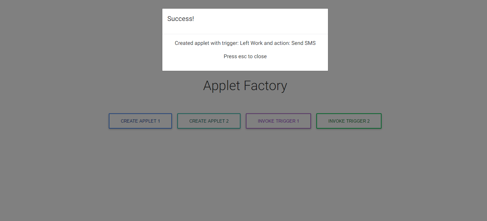

# Applet Factory Concept Demo

### Background

To create a Trigger and Action based application which allows the building of Applets to perform an Action based on the state of a Trigger.

Two use cases are defined below as examples of Trigger and Action pairings (Applets). We should be able to build an Applet from any Trigger and Action pairing.
 
1. When leaving work I want to send a text message to my SO to let them know I'll be home shortly.
2. Every Monday at 9pm I want to send an email to myself to remind me to put the bins out.

### Solution



#### System components:

* Applet Factory API

-A simple API with two endpoints GET /meta - which allows for simple health check of the server and POST /specification which allows for the creation of applets (a trigger and action pairing with specified settings).

-Each successful post request to the /specification endpoint persists an "applet specification" into an in memory redis cache which allows applet specifications to be retrieved by some ID.

### POST /specification

Example: http:/localhost:4567/specification

Example Request body:

    {  
        "userDetails" : {
	        "userId" : "jane"
	    },
        "applet" : {  
            "id":"appletid",
            "trigger" : {
      	        "id" : "triggerId",
      	        "type" : "leftWork"
            },
            "action" : {
      	        "id" : "actionId",
      	        "type" : "sendSms"
            },
            "settings" : {
      	        "smsAddress" : "07817856709",
      	        "smsContent" : "I'll be back soon!"
            }
        }
    }

* Applet Factory Web Application

A very simplified visual interface to the Applet Factory API.

Ideally should allow users to:

-Create a trigger and action pairing

-Specify any required details

-Register their applet

The MVP interface simple has two "create applet buttons" one for each type defined in the use case.
These can be more closely inspected via the postman collection provided below. 

I've also added two "trigger buttons" for testing and to obverse the system works, this simply calls the local trigger component which has a socket connection to the applet factory API to allow real time triggering.

* Local Trigger simulator

This is a server application with a socket connection to the applet factory API to allow simulation of triggers in real time.

#### System design flaws/todos:

* Add Data validation
* Add Security
* Add CRUD functionality for applets
* Add Input form for web interface
* Modularise applet creation through interface
* Add functionality for one to many trigger-action pairings
* Add Realtime visual feedback in web interface
* Add validation to form post on button click
* Modularise scripts 
* Make object IDs unique
* Convert action switch-case matching mechanism to key-value store lookup
* Separate applet factory into smaller components
* Add proper error handling
* Add real testing
* Add logic for email sending
* Add logic for SMS sending
* Enhance performance/ test performance

### Prerequisities

* node/npm

### Install and Run Each project Locally

1. Clone the repo
2. Run: ```npm install``` to install project dependencies
3. Run: ```npm start``` to kickstart and run the applet factory API or ```npm start:all``` to also kick off the local trigger simulator also.
4. Run: ```npm start:local-trigger``` to kickstart and run the local trigger simulator
5. Change to the applet-factory.interface's directory Run: ```npm run start``` to kickstart and run the applet factory interface
6. To use the web interface open your browser and navigate to: ```localhost:8080```
7. Messages will be logged out on the console which kicked off the applet facotry API process.

## Running the Tests

- ```npm run test```

## Test the app via POSTMAN

[](https://app.getpostman.com/run-collection/feee6893f79e54fd8315)